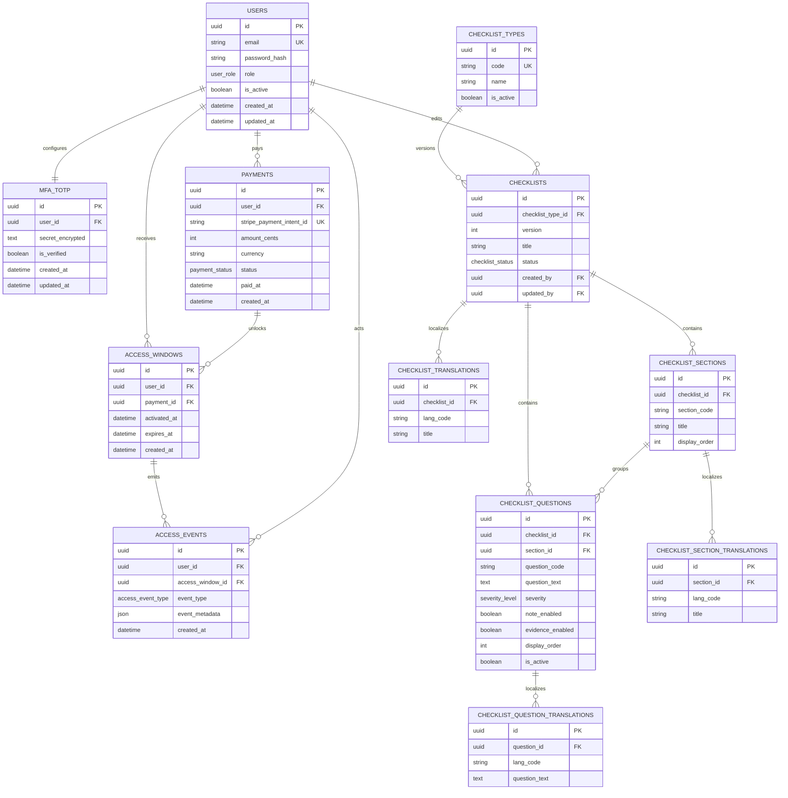
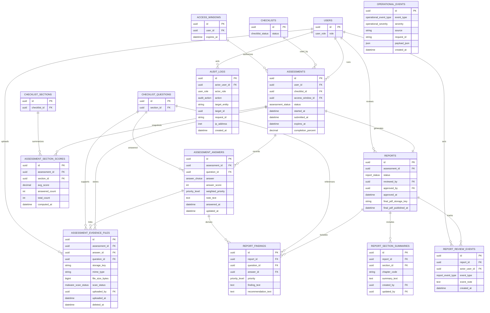

# Backend Schema (Complete Target Model)

This document defines the full backend schema for the app MVP, including checklist content management, assessments, evidence, reports, admin review workflow, and audit logging.

Status legend:
- Implemented: already present in current backend models.
- Target MVP: required schema for full app scope and should be added in upcoming migrations.

## 1. Identity, Access, Payment

### users (Implemented)
- id: uuid pk
- email: varchar unique not null
- password_hash: varchar not null
- role: user_role not null
- is_active: boolean not null default true
- created_at: timestamptz not null
- updated_at: timestamptz not null

### mfa_totp (Target MVP)
One row per user TOTP setup.
- id: uuid pk
- user_id: uuid fk -> users.id unique not null
- secret_encrypted: text not null
- is_verified: boolean not null default false
- backup_codes_hash: jsonb null
- created_at: timestamptz not null
- updated_at: timestamptz not null

### payments (Implemented)
- id: uuid pk
- user_id: uuid fk -> users.id not null
- stripe_payment_intent_id: varchar unique not null
- amount_cents: integer not null
- currency: char(3) not null default 'USD'
- status: payment_status not null default 'pending'
- paid_at: timestamptz null
- created_at: timestamptz not null

### access_windows (Implemented, semantics extended)
Access is unlocked after successful payment, but the 7-day countdown starts only when assessment starts.
- id: uuid pk
- user_id: uuid fk -> users.id not null
- payment_id: uuid fk -> payments.id null
- activated_at: timestamptz not null
- expires_at: timestamptz not null
- created_at: timestamptz not null

### access_events (Target MVP)
Operational trace for unlock, start, expiry, and manual admin actions.
- id: uuid pk
- user_id: uuid fk -> users.id not null
- access_window_id: uuid fk -> access_windows.id not null
- event_type: access_event_type not null
- event_metadata: jsonb null
- created_at: timestamptz not null

## 2. Checklist Content Administration

### checklist_types (Target MVP)
Allows future product expansion and multiple checklist families.
- id: uuid pk
- code: varchar unique not null
- name: varchar not null
- description: text null
- is_active: boolean not null default true
- created_at: timestamptz not null
- updated_at: timestamptz not null

### checklists (Target MVP)
Versioned checklist definitions.
- id: uuid pk
- checklist_type_id: uuid fk -> checklist_types.id not null
- version: integer not null
- title: varchar not null
- description: text null
- status: checklist_status not null default 'draft'
- effective_from: date null
- effective_to: date null
- created_by: uuid fk -> users.id not null
- updated_by: uuid fk -> users.id not null
- created_at: timestamptz not null
- updated_at: timestamptz not null

Unique constraint:
- unique(checklist_type_id, version)

### checklist_sections (Target MVP)
- id: uuid pk
- checklist_id: uuid fk -> checklists.id not null
- section_code: varchar not null
- title: varchar not null
- source_ref: varchar null
- display_order: integer not null
- created_at: timestamptz not null
- updated_at: timestamptz not null

Unique constraints:
- unique(checklist_id, section_code)
- unique(checklist_id, display_order)

### checklist_questions (Target MVP)
Maps directly to Excel-based admin content model.
- id: uuid pk
- checklist_id: uuid fk -> checklists.id not null
- section_id: uuid fk -> checklist_sections.id not null
- question_code: varchar not null
- paragraph_title: varchar null
- legal_requirement: text not null
- question_text: text not null
- explanation: text null
- expected_implementation: text null
- guidance_score_4: text null
- guidance_score_3: text null
- guidance_score_2: text null
- guidance_score_1: text null
- recommendation_template: text null
- severity: severity_level not null
- report_domain: varchar null
- report_chapter: varchar null
- illustrative_image_url: text null
- note_enabled: boolean not null default true
- evidence_enabled: boolean not null default true
- final_score_mode: question_score_mode not null default 'answer_only'
- display_order: integer not null
- is_active: boolean not null default true
- created_at: timestamptz not null
- updated_at: timestamptz not null

Unique constraints:
- unique(checklist_id, question_code)
- unique(section_id, display_order)

### checklist_translations (Target MVP, multilingual-ready)
Prepared for future languages without changing core table shape.
- id: uuid pk
- checklist_id: uuid fk -> checklists.id not null
- lang_code: varchar(10) not null
- title: varchar not null
- description: text null
- created_at: timestamptz not null

Unique constraint:
- unique(checklist_id, lang_code)

### checklist_section_translations (Target MVP)
- id: uuid pk
- section_id: uuid fk -> checklist_sections.id not null
- lang_code: varchar(10) not null
- title: varchar not null
- created_at: timestamptz not null

Unique constraint:
- unique(section_id, lang_code)

### checklist_question_translations (Target MVP)
- id: uuid pk
- question_id: uuid fk -> checklist_questions.id not null
- lang_code: varchar(10) not null
- question_text: text not null
- explanation: text null
- expected_implementation: text null
- guidance_score_4: text null
- guidance_score_3: text null
- guidance_score_2: text null
- guidance_score_1: text null
- recommendation_template: text null
- created_at: timestamptz not null

Unique constraint:
- unique(question_id, lang_code)

## 3. Assessment Runtime

### assessments (Target MVP)
Customer attempt lifecycle; links payment access and active checklist version.
- id: uuid pk
- user_id: uuid fk -> users.id not null
- checklist_id: uuid fk -> checklists.id not null
- access_window_id: uuid fk -> access_windows.id not null
- started_at: timestamptz null
- submitted_at: timestamptz null
- status: assessment_status not null default 'not_started'
- expires_at: timestamptz not null
- completion_percent: numeric(5,2) not null default 0
- created_at: timestamptz not null
- updated_at: timestamptz not null

Rule:
- 7-day timer starts from started_at (not from payment time).

### assessment_answers (Target MVP)
- id: uuid pk
- assessment_id: uuid fk -> assessments.id not null
- question_id: uuid fk -> checklist_questions.id not null
- answer: answer_choice not null
- answer_score: smallint not null
- weighted_priority: priority_level null
- note_text: text null
- answered_at: timestamptz not null
- updated_at: timestamptz not null

Unique constraint:
- unique(assessment_id, question_id)

### assessment_evidence_files (Target MVP)
Allowed mime types in MVP: pdf, png, jpg, jpeg.
- id: uuid pk
- assessment_id: uuid fk -> assessments.id not null
- answer_id: uuid fk -> assessment_answers.id null
- question_id: uuid fk -> checklist_questions.id not null
- storage_key: varchar not null
- original_filename: varchar not null
- mime_type: varchar not null
- file_size_bytes: bigint not null
- sha256: varchar(64) not null
- scan_status: malware_scan_status not null default 'pending'
- uploaded_by: uuid fk -> users.id not null
- uploaded_at: timestamptz not null
- deleted_at: timestamptz null

### assessment_section_scores (Target MVP, denormalized)
Snapshot for dashboard/report generation.
- id: uuid pk
- assessment_id: uuid fk -> assessments.id not null
- section_id: uuid fk -> checklist_sections.id not null
- avg_score: numeric(4,2) not null
- answered_count: integer not null
- total_count: integer not null
- computed_at: timestamptz not null

Unique constraint:
- unique(assessment_id, section_id)

## 4. Reporting and Review Workflow

### reports (Target MVP)
Draft is generated by system, final is released after admin approval.
- id: uuid pk
- assessment_id: uuid fk -> assessments.id unique not null
- status: report_status not null default 'draft_generated'
- draft_generated_at: timestamptz null
- reviewed_by: uuid fk -> users.id null
- reviewed_at: timestamptz null
- approved_by: uuid fk -> users.id null
- approved_at: timestamptz null
- final_pdf_storage_key: varchar null
- final_pdf_published_at: timestamptz null
- created_at: timestamptz not null
- updated_at: timestamptz not null

### report_section_summaries (Target MVP)
Admin-authored chapter/domain summaries.
- id: uuid pk
- report_id: uuid fk -> reports.id not null
- section_id: uuid fk -> checklist_sections.id null
- chapter_code: varchar null
- summary_text: text not null
- created_by: uuid fk -> users.id not null
- updated_by: uuid fk -> users.id not null
- created_at: timestamptz not null
- updated_at: timestamptz not null

### report_findings (Target MVP)
Prioritized findings derived from severity + answer.
- id: uuid pk
- report_id: uuid fk -> reports.id not null
- question_id: uuid fk -> checklist_questions.id not null
- answer_id: uuid fk -> assessment_answers.id not null
- priority: priority_level not null
- finding_text: text not null
- recommendation_text: text null
- created_at: timestamptz not null

### report_review_events (Target MVP)
Tracks review/approval actions for auditing.
- id: uuid pk
- report_id: uuid fk -> reports.id not null
- actor_user_id: uuid fk -> users.id not null
- event_type: report_event_type not null
- event_note: text null
- created_at: timestamptz not null

## 5. Audit and Operational Logging

### audit_logs (Target MVP)
Immutable audit trail for security and compliance actions.
- id: uuid pk
- actor_user_id: uuid fk -> users.id null
- actor_role: user_role null
- action: audit_action not null
- target_entity: varchar not null
- target_id: uuid null
- request_id: varchar null
- ip_address: inet null
- user_agent: text null
- before_json: jsonb null
- after_json: jsonb null
- created_at: timestamptz not null

### operational_events (Target MVP)
System-level events useful for SIEM and troubleshooting.
- id: uuid pk
- event_type: operational_event_type not null
- severity: operational_severity not null
- source: varchar not null
- request_id: varchar null
- payload_json: jsonb null
- created_at: timestamptz not null

## 6. Retention and Deletion Controls

Assessment-related records should support timed cleanup:
- assessments: retention_expires_at (derived), purged_at
- assessment_answers: purged_at
- assessment_evidence_files: deleted_at, purged_at
- reports: draft_deleted_at, final_deleted_at (if policy allows)

Accounting/payment records are retained separately per legal/accounting requirements and are not tied to short assessment retention windows.

## 7. Enums

### user_role
- admin
- auditor
- customer

### payment_status
- pending
- succeeded
- failed

### checklist_status
- draft
- published
- archived

### severity_level
- low
- medium
- high

### answer_choice
- yes
- partially
- dont_know
- no

### priority_level
- low
- medium
- high

### assessment_status
- not_started
- in_progress
- submitted
- expired
- closed

### report_status
- draft_generated
- under_review
- changes_requested
- approved
- published

### report_event_type
- draft_generated
- review_started
- summary_updated
- changes_requested
- approved
- published

### access_event_type
- unlocked_after_payment
- assessment_started
- access_expired
- manually_extended
- manually_revoked

### malware_scan_status
- pending
- clean
- infected
- failed

### question_score_mode
- answer_only
- answer_with_adjustment

### audit_action
- auth_login
- auth_logout
- auth_mfa_verify
- checklist_create
- checklist_update
- checklist_publish
- assessment_submit
- report_approve
- report_publish
- user_role_change

### operational_event_type
- payment_webhook_received
- payment_webhook_processed
- report_generation_started
- report_generation_finished
- retention_job_started
- retention_job_finished
- file_scan_completed

### operational_severity
- info
- warning
- error

## 8. Mermaid ER Diagram (Core + Content)

## 9. Mermaid ER Diagram (Assessment + Report + Logs)

## 10. MVP Workflow Mapping

- Payment webhook updates payments.status to succeeded.
- Access is unlocked by creating/updating access_windows.
- 7-day timer starts when assessments.started_at is set.
- Customer submits answers and optional evidence.
- System generates draft reports and findings.
- Admin/auditor adds summaries, performs review, then approves.
- Final PDF path is saved in reports.final_pdf_storage_key and published timestamp is recorded.
- Audit and operational events are persisted for traceability and SIEM-forwarding pipelines.
